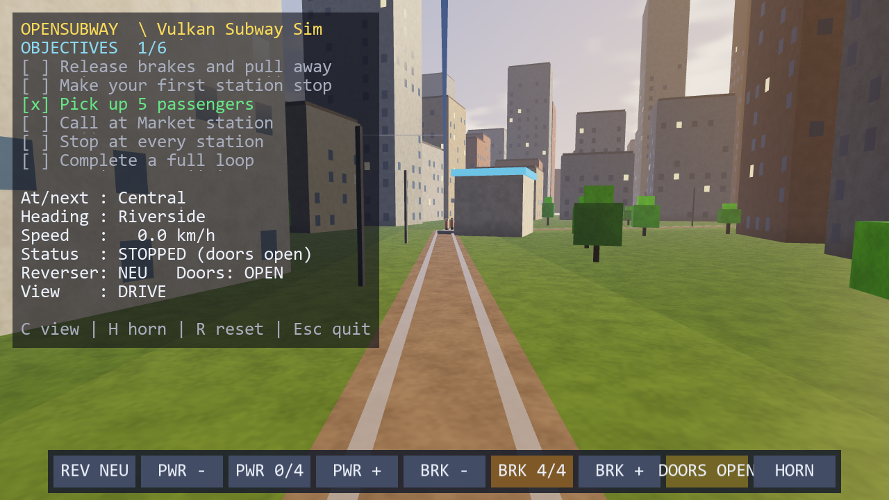

# OpenSubWay

A 3D **city subway driving** simulator written in **Python 3.12** and
rendered with **Vulkan**.

You sit in the **driver's cab** and drive the train yourself from an on-screen
**control panel** — throttle, brake, reverser and doors — through a sunlit
city under a procedural sky, stopping at platforms where **passengers
wait and board** when you open the doors. Fully synthesized **sound** (rail
rumble, station chimes, horn, city ambience) and an **objectives panel** round
it out.



## Features

- Hand-written **Vulkan** renderer (via the `vulkan` bindings): swapchain with a
  depth buffer, **4× MSAA** anti-aliasing (resolve pass), a 3D scene pipeline
  with **golden-hour lighting** (warm low sun + dusk sky-hemisphere ambient,
  per-surface **gloss/translucency materials**, Blinn-Phong specular, fresnel
  sky sheen, sRGB-linear shading, ACES tonemapping, procedural surface grain,
  aerial-perspective fog), a fullscreen **procedural sky** pass (sun disc +
  halo, drifting FBM cumulus with sun-facing shading and silver linings), and
  a separate alpha-blended text/UI pipeline.
- **First-person cab view** (default), plus chase and free orbit — cycle with
  `C` or jump straight to one with `1` / `2` / `3`.
- **In-game Options menu** (`Tab`): pause, mute, master volume, field of view,
  and HUD visibility, with an on-screen list of every control.
- **Manual driving** from a clickable control panel: **Throttle**, **Brake**,
  **Reverser** (F/N/R), **Doors**, **Horn** — the train stays on the rails.
- Procedural **city at golden hour**: a grid of buildings flanking the railway
  with specular glass windows, plus line-side trees the low sun shines through
  (translucent canopies), catenary masts and an overhead wire.
- **Reactive passengers**: NPCs wait on platforms and board when you stop with
  the doors open (counts toward objectives).
- Procedural **audio** (numpy-synthesized, played via `pygame.mixer`): speed-
  driven rumble, door/station chime, horn, and a city-ambience bed. Degrades
  gracefully with no audio device.
- **Objectives HUD** rendered from a Pillow font atlas, updating live.
- Headless `pytest` suite for the simulation, driving physics, and the panel.

## Requirements

- Python 3.12
- A Vulkan driver. **No GPU?** This project bundles/uses **Mesa lavapipe** (a CPU
  Vulkan driver) so it runs even in a VM — see below. (CPU rendering, so expect
  ~20–30 FPS with the full city + MSAA.)
- The **Vulkan SDK** (for `glslc`) to compile the GLSL shaders.

## Setup

```bash
python -m venv .venv
.venv\Scripts\python -m pip install -r requirements.txt
```

### Software Vulkan (VMs / no GPU)

A prebuilt **lavapipe** (llvmpipe) driver lives under `.vulkan/mesa/x64/` and
`main.py` points the Vulkan loader at it automatically. To force a real GPU
instead, set `OPENSUBWAY_USE_GPU=1`.

## Run

```bash
.venv\Scripts\python main.py
```

Shaders compile to SPIR-V automatically on first run (needs `glslc` from the
Vulkan SDK). To silence audio: `OPENSUBWAY_NOAUDIO=1`.

## How to drive

Click the buttons at the bottom of the window:

1. **DOORS** to close the doors.
2. **REV** to select **FWD** (forward).
3. **BRK −** to release the brakes (down to 0).
4. **PWR +** to apply power — the train pulls away.
5. Approaching a station, **PWR −** to coast and **BRK +** to stop at the
   platform. Then **DOORS** to let passengers board.

### Switching the camera

Three views are available — **drive** (first-person cab), **chase** (behind the
train) and **orbit** (free-fly around the whole loop):

- Press **`C`** to cycle **drive → chase → orbit**, or
- Press **`1`**, **`2`** or **`3`** to jump straight to drive / chase / orbit.
- In orbit view, **drag** to rotate and use the **scroll wheel** to zoom.

The current view is shown in the HUD (`View : …`).

### Settings (Options menu)

Press **`Tab`** to open the on-screen **Options** overlay. It lists every
control and the live settings, which you adjust with:

| Key        | Setting                                   |
|------------|-------------------------------------------|
| `Space`    | Pause / resume                            |
| `M`        | Mute / unmute audio                       |
| `-` / `=`  | Master volume down / up                   |
| `[` / `]`  | Field of view narrower / wider            |
| `F1`       | Show / hide the status HUD                |
| `Tab`      | Open / close the Options menu             |

### Full key / mouse reference

| Key / Mouse         | Action                                     |
|---------------------|--------------------------------------------|
| Click panel buttons | Drive the train (throttle/brake/rev/doors) |
| `Tab`               | Open / close the Options menu              |
| `C` / `1` `2` `3`   | Cycle camera / select drive · chase · orbit |
| Mouse drag / scroll | Orbit / zoom (in orbit view)               |
| `Space`             | Pause / resume                             |
| `M`, `-`, `=`       | Mute, volume down, volume up               |
| `[`, `]`            | Field of view narrower / wider             |
| `F1`                | Show / hide status HUD                     |
| `H`                 | Horn                                       |
| `R`                 | Reset                                      |
| `Esc`               | Close the menu, or quit                    |

## Tests

```bash
.venv\Scripts\python -m pytest
```

## Project layout

```
main.py                     entry (software Vulkan + shader compile)
tools/compile_shaders.py    GLSL -> SPIR-V
opensubway/
  config.py                 window, timings, city/passenger/audio params
  app.py                    window + main loop
  input.py                  keyboard + mouse (panel clicks)
  vk/                       Vulkan layer (context, swapchain w/ MSAA, pipelines,
                            texture, commands, renderer) + shaders
  render/                   camera, mesh, worldmesh, city, people, hud, panel
  sim/                      world/line, station, train (manual), passengers,
                            objectives, simulation
  audio/                    procedural synth + pygame playback
tests/                      headless tests (train, objectives, panel)
```

See [TODO.md](TODO.md) for the roadmap.
